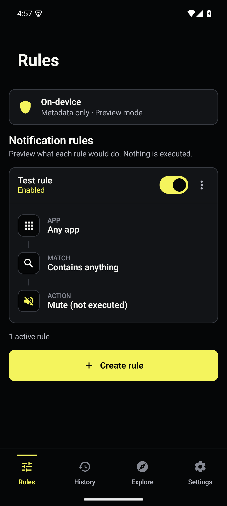

# NoNo

NoNo is an independent clean-room Android reconstruction of the native interface and observable behavior documented in `../app-audit`. It does not use the original package identity, proprietary source, branding, illustrations, font files, signing material, private data, or APK assets.

Version 1.4.0 applies a new AMOLED black, graphite, and citron interface across every page. The
reference mockups, implementation captures, accessibility checks, and side-by-side comparisons are
listed in [`../design-qa.md`](../design-qa.md).



## Project identity

- Display name: **NoNo**
- Product descriptor: **Notification rule manager**
- Application ID: `com.sysadmindoc.nono`
- Debug package: `com.sysadmindoc.nono.debug`
- Android support: API 24 and newer; target SDK 36; compiled with SDK 37
- Reference device: Android 16/API 36, 1080 × 2400 px, 420 dpi, `en-US`, font scale 1.0, gesture navigation
- Backend: none. Notification metadata, rules, and diagnostics are local and deterministic.
  The current Room history schema is version 7; the DataStore rule payload is version 3.

## Requirements

- Windows PowerShell 5.1 or newer
- JDK 21, an LTS OpenJDK build. `gradle/gradle-daemon-jvm.properties` pins the daemon to Java 21,
  so Gradle finds an installed 21 no matter what `JAVA_HOME` points at, and this Gradle cannot
  download one for you. Android Studio's bundled JBR is currently OpenJDK 25, which this Gradle
  cannot compile a build script under, so do not hand it to the build directly. The PowerShell
  scripts pick a supported JDK for you.
- Android SDK platform tools and an authorized ADB device
- Python 3 for screenshot comparison: `py -3 -m pip install -r scripts/requirements.txt`

All device commands require an explicit serial when more than one device is connected.
`check-environment.ps1` fails when the device does not match the reference environment
recorded in `../app-audit/device/device-environment.json`, because baseline captures are
only comparable against a matching device. Pass `-AllowMismatch` to downgrade to a warning.

## Build, install, and launch

From the `replica-app` directory of your clone:

```powershell
.\scripts\check-environment.ps1 -Serial emulator-5554
.\scripts\build-debug.ps1
.\scripts\install-debug.ps1 -Serial emulator-5554
.\scripts\launch-replica.ps1 -Serial emulator-5554
```

That produces `app\build\outputs\apk\debug\app-debug.apk`, which is for development only.

## Release builds

The APK in `dist\` is the signed, non-debuggable release, and `dist\SHA256SUMS.txt` records its
hash. The APK is not tracked in git; the checksum file is, so a downloaded artifact can be
checked against it.

Signing credentials live in `replica-app\keystore.properties`, which is gitignored and never
committed. It names four values:

```properties
storeFile=C:/path/to/nono-release.jks
storePassword=...
keyAlias=nono
keyPassword=...
```

Without that file `assembleRelease` fails at `verifyReleaseSigning` rather than quietly producing
an unsigned APK. Signatures are v2 and v3; v1 is off because the minimum supported Android
version is 7.0, which understands v2.

To build a release and record what produced it:

```powershell
.\scripts\reproducible-release.ps1
```

It builds twice from clean copies of the tree, compares the unsigned APKs, signs one of them, and
verifies the signature with `apksigner verify --print-certs`. The `reproducibility.json` it writes
alongside records the commit and whether the tree was dirty, the OS and architecture, the JDK,
Gradle, AGP, Kotlin, KSP, build-tools and compile SDK, the dependency-verification state, the
exact Gradle invocation, both unsigned hashes, the signed hash, and the signer's certificate
SHA-256. If the two builds disagree it keeps both APKs and names them, ready for diffoscope.

Pass `-SkipSigning` on a machine without the keystore to check determinism alone.

To check an APK you already have:

```powershell
& "$env:LOCALAPPDATA\Android\Sdk\build-tools\37.0.0\apksigner.bat" verify --print-certs NoNo-v1.4.0-reconstruction.apk
```

The signer certificate SHA-256 is
`f64b4691203ed903ddd4007d7630a65045ef2ad20d579388444bce22c482a724`. Every release is signed with
that key, so a build reporting a different one did not come from this project.

## Tests and validation

```powershell
.\scripts\run-unit-tests.ps1
.\scripts\run-lint.ps1
.\scripts\run-ui-tests.ps1 -Serial emulator-5554
.\scripts\run-visual-validation.ps1 -Serial emulator-5554
.\scripts\run-full-validation.ps1 -Serial emulator-5554
```

The visual command intentionally returns a nonzero result while any configured threshold miss remains. See `validation\reports\visual-validation-report.md` and `validation\reports\final-coverage-report.md` before interpreting that exit code.

Gradle dependency verification is enabled through `gradle\verification-metadata.xml`, which
records SHA-256 hashes for the resolved artifacts. Refresh it only after reviewing the dependency
diff with `gradlew --write-verification-metadata sha256 help`; PGP key verification is not enabled
until the project owner reviews and approves the required signer keys. Run
`.\gradlew.bat verifyBuildPolicy` from `replica-app` to validate repository, wrapper, catalog,
and hash-coverage policy locally. Run the strict verification before every release.

## Reproducing audited states

Every native audit capture can be opened through a debug-only intent extra:

```powershell
.\scripts\launch-replica.ps1 -Serial emulator-5554 -State 062_rule_builder_complete
```

The complete 76-state mapping is in `test-data\states\audit-state-map.csv`. Release builds do not accept this QA override.

## Clean-room and asset notes

`authorized-assets` contains no third-party originals. The launcher art, product identity, onboarding visuals, Explore visuals, and editorial summaries are independently created replacements. AndroidX/platform icons and fonts are used under their respective dependency/platform terms. Audit screenshots exist only as validation evidence and are never packaged into the APK.

## What this build does not do

The reconstruction reproduces the audited interface while providing a safe local metadata
runtime. It is not a live notification action manager, and the UI states the boundary at each
control rather than leaving the reader to infer it:

- **Live evaluation and actions are absent.** The app includes a pure, redaction-aware dry-run
  evaluator for history activity and rule explanations; it never changes a notification, sound,
  setting, or `PendingIntent`.
- **No notification content is stored.** The listener records package identity, notification key,
  posted time, channel/group/summary metadata, content provenance, bounded ingestion counters, and
  failure timestamps. Titles and bodies are never persisted.
- **Automatic backups and launcher shortcuts are not implemented.** Encrypted rule import/export
  is available through Android's Storage Access Framework, with a passphrase, preview, conflict
  choice, cancellation/error handling, and no notification history in the file. Automatic backup
  scheduling remains unavailable.
- **Dark, light, and system themes are available** and the choice is persisted. The app ships no
  translated resources, so the Language row stays unavailable and the app follows the system locale.
- **History is bounded and queryable.** Search and package/channel/group/content-provenance and
  summary filters are backed by Room migrations and explicit loading/error/retry states. Debug
  captures remain available for deterministic audit states.

The runtime boundary records metadata in a bounded Room queue. Android 15 sensitive-notification
redaction is treated as provenance (`content hidden by system`) and is never matchable as real
text. Preferences and history live under the no-backup boundary; listener diagnostics restore
after process restart. Companion-device listener exemptions are not implemented in this local
reconstruction, and no special permission or companion association is requested.
Notification capture can be paused from the Quick Settings tile or Settings without revoking
listener access; paused callbacks are ignored before sanitization and the gate survives restart.
The optional home-screen widget shows only the bounded metadata count, latest timestamp,
content-provenance state, or paused state; it never renders notification content or package names.

Settings that would depend on the absent action engine are shown disabled with the reason
inline. See `docs\known-deviations.md` for the full list and `..\ROADMAP.md` for what is
planned.

## Documentation

- `docs\rebuild-plan.md` covers scope and implementation order
- `docs\audit-traceability-matrix.csv` maps all 88 audit rows to implementation and evidence
- `docs\architecture.md` documents the clean-room architecture
- `docs\testing-guide.md` contains the repeatable QA procedure
- `validation\reports\final-coverage-report.md` records measured outcomes and remaining gaps
