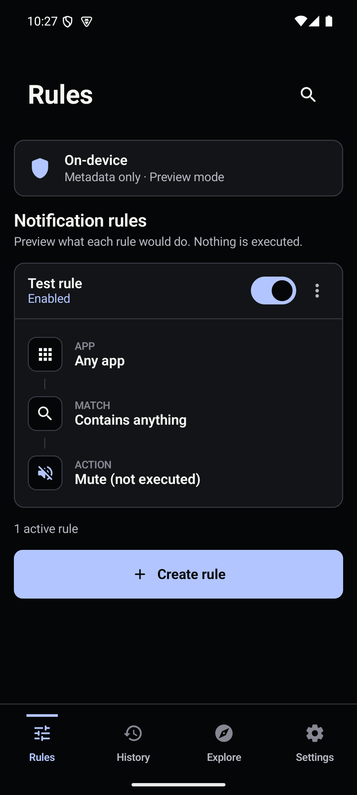
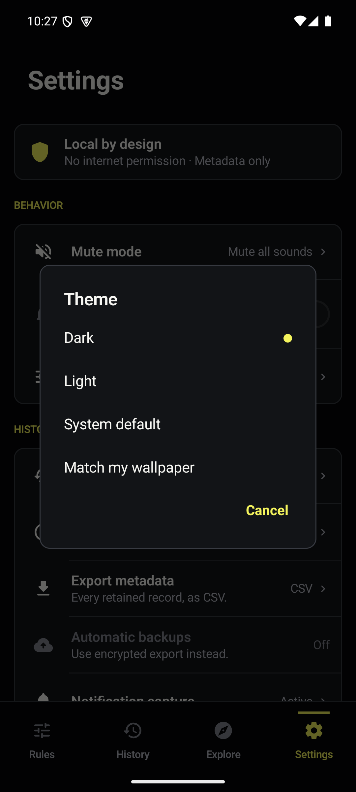
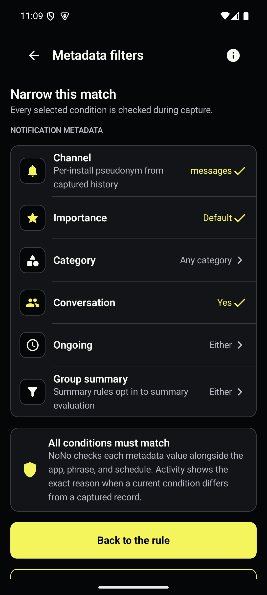
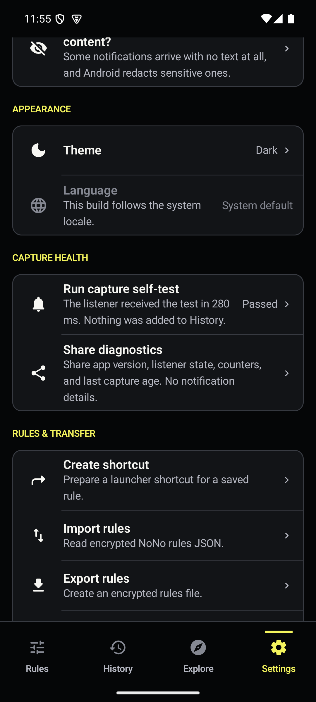
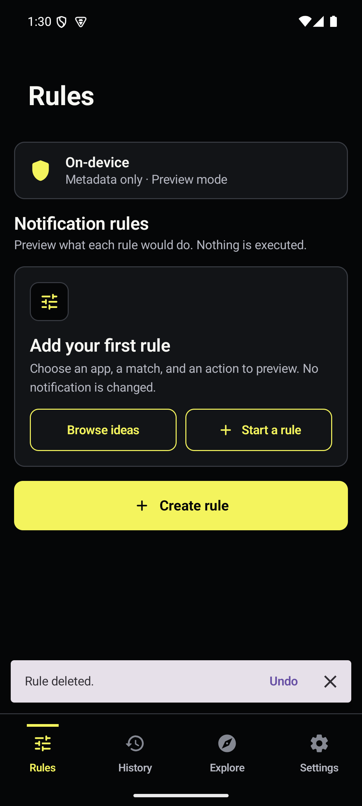

# NoNo

NoNo is an independent clean-room Android reconstruction of the native interface and observable behavior documented in `../app-audit`. It does not use the original package identity, proprietary source, branding, illustrations, font files, signing material, private data, or APK assets.

Version 1.4.1 adds an optional wallpaper-matched accent on Android 12 and newer. The app checks the
derived colour on every surface where the accent appears and keeps its built-in accent if the
wallpaper colour is not readable. The v1.4.0 reference mockups, implementation captures,
accessibility checks, and side-by-side comparisons are listed in
[`../design-qa.md`](../design-qa.md).

Rules can also test the metadata Android supplies with a notification. Channel pseudonym,
importance, category, conversation status, ongoing status, and group-summary status are available
in the filter editor. Every selected condition must match. Category values outside Android's
documented list are discarded. A transferred channel filter is marked for reselection and cannot
match until the user picks a channel on the receiving install.

Settings includes a capture self-test. It posts one temporary NoNo notification, waits up to eight
seconds for the real listener callback, then reports Pass or Fail. The check is never written to
History or counted as ingestion. The adjacent share action creates a plain-text diagnostics report
without notification content or posting-app identifiers.

Explore leads to an Insights screen built entirely from stored metadata. It reports the total
captured, the most active apps, an hour-of-day histogram, a fourteen-day trend, and a match count
for every saved rule. The counts exclude group summaries, as every other count in the app does, and
the screen states the relationship between its total and the History total instead of leaving the
two to disagree.

Rule deletion is immediate and recoverable. Deleting one rule offers Undo, as does deleting the
whole list. A second deletion restores the earlier pending rule before it takes over the snackbar.

Android 17 adds a removal reason for a notification cleared with its organizer bundle. History
labels that reason "Cleared with its bundle" but does not put it in the Dismissed filter because
Android does not say who dismissed the bundle.











## Project identity

- Display name: **NoNo**
- Product descriptor: **Notification rule manager**
- Application ID: `com.sysadmindoc.nono`
- Debug package: `com.sysadmindoc.nono.debug`
- Android support: API 24 and newer; target SDK 36; compiled with SDK 37
- Reference device: Android 16/API 36, 1080 × 2400 px, 420 dpi, `en-US`, font scale 1.0, gesture navigation
- Backend: none. Notification metadata, rules, and diagnostics are local and deterministic.
  The current Room history schema is version 11; the DataStore rule payload is version 5.
- Permissions: normal capture uses Android's notification-listener access. On Android 13 and newer,
  `POST_NOTIFICATIONS` is requested only after the user taps the capture self-test, because that
  check must post one temporary notification. Denying it does not affect normal capture.
  WorkManager, which runs the scheduled rule backup, adds four install-time permissions to the
  merged manifest: `WAKE_LOCK` for the seconds a backup takes, `RECEIVE_BOOT_COMPLETED` so the
  schedule survives a restart, `ACCESS_NETWORK_STATE` for connectivity constraints this app does
  not set, and `FOREGROUND_SERVICE` for an expedited path this app never asks for. None of them
  moves data anywhere. `INTERNET` is still absent, and `AppCatalogVisibilityTest` asserts the exact
  permission list on a real device so an unexplained arrival fails the suite.

## Requirements

- Windows PowerShell 5.1 or newer
- JDK 21, an LTS OpenJDK build. `gradle/gradle-daemon-jvm.properties` pins the daemon to Java 21,
  so Gradle finds an installed 21 no matter what `JAVA_HOME` points at, and this Gradle cannot
  download one for you. Android Studio's bundled JBR is currently OpenJDK 25, which this Gradle
  cannot compile a build script under, so do not hand it to the build directly. The PowerShell
  scripts pick a supported JDK for you.
- Android SDK platform tools and an authorized ADB device
- Python 3 for screenshot comparison: `py -3 -m pip install -r scripts/requirements.txt`

All device commands require an explicit serial when more than one device is connected.
`check-environment.ps1` fails when the device does not match the reference environment
recorded in `../app-audit/device/device-environment.json`, because baseline captures are
only comparable against a matching device. Pass `-AllowMismatch` to downgrade to a warning.

## Build, install, and launch

From the `replica-app` directory of your clone:

```powershell
.\scripts\check-environment.ps1 -Serial emulator-5554
.\scripts\build-debug.ps1
.\scripts\install-debug.ps1 -Serial emulator-5554
.\scripts\launch-replica.ps1 -Serial emulator-5554
```

That produces `app\build\outputs\apk\debug\app-debug.apk`, which is for development only.

## Release builds

The APK in `dist\` is the signed, non-debuggable release, and `dist\SHA256SUMS.txt` records its
hash. The APK is not tracked in git; the checksum file is, so a downloaded artifact can be
checked against it.

Signing credentials live in `replica-app\keystore.properties`, which is gitignored and never
committed. It names four values:

```properties
storeFile=C:/path/to/nono-release.jks
storePassword=...
keyAlias=nono
keyPassword=...
```

Without that file, the tasks that write a release artifact refuse to run: `packageRelease`,
`packageReleaseBundle` and `signReleaseBundle`. The guard is on those rather than on
`assembleRelease`, because a dependency on the lifecycle task imposes no ordering and the unsigned
APK was already on disk by the time it fired. Building an unsigned release on purpose takes
`-PallowUnsignedRelease=true`, which the reproducibility check passes; note that Gradle reads
properties from `~/.gradle/gradle.properties` too, so a value set there applies without appearing
in the repository.

Signatures are v2 and v3. v1 is off because the minimum supported Android version is 7.0, which
understands v2.

To build a release and record what produced it:

```powershell
.\scripts\reproducible-release.ps1
```

It builds twice from clean copies of the tree, compares the unsigned APKs, signs one of them, and
verifies the signature with `apksigner verify --print-certs`. The `reproducibility.json` it writes
alongside records the commit and whether the tree was dirty, the OS and architecture, the JDK,
Gradle, AGP, Kotlin, KSP, build-tools and compile SDK, the dependency-verification state, the
exact Gradle invocation, both unsigned hashes, the signed hash, and the signer's certificate
SHA-256. If the two builds disagree it keeps both APKs and names them, ready for diffoscope.

Pass `-SkipSigning` on a machine without the keystore to check determinism alone.

To check an APK you already have:

```powershell
& "$env:LOCALAPPDATA\Android\Sdk\build-tools\37.0.0\apksigner.bat" verify --print-certs NoNo-v1.4.1-reconstruction.apk
```

The signer certificate SHA-256 is
`f64b4691203ed903ddd4007d7630a65045ef2ad20d579388444bce22c482a724`. Every release is signed with
that key, so a build reporting a different one did not come from this project.

## Android 17 behavior changes, checked against this app

The app targets SDK 36 today. The behavior changes below are gated on targeting Android 17, so
none of them is in force yet; this is the check done before that move rather than after it. The
list was read from the Android 17 behavior-changes page on **2026-08-31** and each entry was
checked against the code rather than assumed. Recheck it when the target actually moves, and write
the date you read it.

Changes that would need something from this app: none. What was checked, and why each one is inert
here:

- **RemoteViews memory limit.** The home-screen widget is the only RemoteViews this app builds.
  `widget_signal_status.xml` is three `TextView`s and it sets text only, so no bitmap or icon ever
  enters the tree and the limit cannot be reached.
- **Lock-free MessageQueue, and static final fields becoming unmodifiable.** Both only affect code
  that reflects into platform internals. This app contains no reflection.
- **Local network permission.** Applies to apps that discover or connect to devices on the LAN.
  This app has no `INTERNET` permission and opens no sockets.
- **Encrypted Client Hello, and certificate transparency on by default.** Both are about outgoing
  HTTPS, which this app never makes.
- **Background Activity Launch restrictions extended to IntentSender.** The only `PendingIntent`
  here is the widget's tap target, which starts `MainActivity` from a user's tap on the widget.
  Nothing launches an activity from the background.
- **Native code loaded with `System.load` must be read-only.** This app ships no native libraries.
- **Contacts Provider column and SQL restrictions.** No contacts access.
- **Background audio hardening.** No audio.
- **RFCOMM `BluetoothSocket.read()` returning -1.** No Bluetooth.
- **Accessibility events for complex IME typing.** No custom input method.
- **Password masking with a physical keyboard.** The rule-transfer passphrase field is the only
  password input, and the platform decides masking either way.
- **Orientation, resizability and aspect-ratio constraints ignored on large screens.** The manifest
  already sets no `screenOrientation`, and the API 36 opt-out property was never used.

Two are worth stating even though they need no code change:

- **OTP SMS withheld for three hours.** This app is a notification listener with no SMS permission;
  it records only what an app chooses to post. If a messaging app posts less, less is captured, and
  the counts simply reflect that.
- **The four permissions WorkManager adds.** See the permissions note above. They arrived with the
  backup scheduler rather than with the target change, and none of them is affected by Android 17.

The bump itself is held back for one reason only: no Android 17 emulator on this machine stays up
long enough to run the instrumented suite. Every `android-37.0` image tried here crash-loops
`surfaceflinger` inside `mapper.ranchu.so`, taking `system_server` with it. A target change nobody
has run on the target platform is not one worth shipping, so `targetSdk` stays at 36 until the
suite can be run on Android 17. `RemovalReasonPlatformTest` covers the part that can be checked
without one: it compiles against SDK 37 and compares every hard-coded platform reason code against
the constant the running device reports.

## Android developer verification, and what it does and does not cover

Android is introducing a requirement that the developer behind an app be verified. It matters for
how this APK reaches a device, so here is what the requirement actually says as of the Android
developer-verification FAQ dated 2026-07-15.

Enforcement starts 2026-09-30 and applies to participating app stores in Brazil, Indonesia,
Singapore and Thailand. It is a store-side requirement in those four countries on that date, not a
device-wide one. Google has said the requirement widens during 2027; the countries and the exact
dates for that are not settled, so treat anything you read about 2027 as provisional until the
official page says otherwise.

What is not covered by the 2026-09-30 date: installing an APK yourself, and stores that are not
participating. `adb install` keeps working, as does building this project and running
`.\scripts\install-debug.ps1`. Google has also described a flow for experienced users who want to
install unverified apps directly. That flow exists precisely because direct installation is not
the thing being switched off.

This project has not chosen a distribution channel. `..\Roadmap_Blocked.md` records that decision
as open, and nothing here should be read as a plan to publish through a particular store or to
avoid one. Whether verification applies depends entirely on that choice.

**Before any release, recheck this.** The dates and the country list above are a snapshot taken on
2026-08-31 and they will move. Read the official developer-verification page again, write the date
you read it into this section, and correct anything that has changed. A statement about a
regulatory deadline is worth nothing without the date it was true.

## Tests and validation

```powershell
.\scripts\run-unit-tests.ps1
.\scripts\run-lint.ps1
.\scripts\run-ui-tests.ps1 -Serial emulator-5554
.\scripts\run-visual-validation.ps1 -Serial emulator-5554
.\scripts\run-full-validation.ps1 -Serial emulator-5554
```

`CaptureSelfTestRoundTripTest` enables listener access on the isolated test device, posts through
Android's notification manager, waits for the service callback, and confirms that neither History
nor the ingestion counters changed.

The visual command intentionally returns a nonzero result while any configured threshold miss remains. See `validation\reports\visual-validation-report.md` and `validation\reports\final-coverage-report.md` before interpreting that exit code.

Gradle dependency verification is enabled through `gradle\verification-metadata.xml`, which
records SHA-256 hashes for the resolved artifacts. Refresh it only after reviewing the dependency
diff with `gradlew --write-verification-metadata sha256 help`; PGP key verification is not enabled
until the project owner reviews and approves the required signer keys. Run
`.\gradlew.bat verifyBuildPolicy` from `replica-app` to validate repository, wrapper, catalog,
and hash-coverage policy locally. Run the strict verification before every release.

### The build cache is off on purpose

`org.gradle.caching=false`, and `settings.gradle` refuses a remote cache outright. Kotlin 2.4.10
is affected by GHSA-r937-wjx7-w2jp, which concerns the Kotlin Gradle Plugin's build-cache
handling. On 2026-08-31 the first line carrying the fix was 2.4.20-Beta1, and this project does
not build against prereleases, so the cache stays off rather than the version moving early. No
build here needs it: everything compiles on one machine.

`verifyBuildPolicy` fails if the property is flipped back, if the settings guard is deleted, or if
a build is started with `--build-cache`, and it stops enforcing any of that once the catalog names
a Kotlin at or above `KOTLIN_ADVISORY_FLOOR` in `build.gradle`. Raise that constant in the same
commit as the Kotlin and KSP bump, then run the full local suite and the reproducibility script
before trusting the result.

## Reproducing audited states

Every native audit capture can be opened through a debug-only intent extra:

```powershell
.\scripts\launch-replica.ps1 -Serial emulator-5554 -State 062_rule_builder_complete
```

The complete 76-state mapping is in `test-data\states\audit-state-map.csv`. Release builds do not accept this QA override.

## Clean-room and asset notes

`authorized-assets` contains no third-party originals. The launcher art, product identity, onboarding visuals, Explore visuals, and editorial summaries are independently created replacements. AndroidX/platform icons and fonts are used under their respective dependency/platform terms. Audit screenshots exist only as validation evidence and are never packaged into the APK.

## What this build does not do

The reconstruction reproduces the audited interface while providing a safe local metadata
runtime. It is not a live notification action manager, and the UI states the boundary at each
control rather than leaving the reader to infer it:

- **Rule evaluation is local; device actions are absent.** The listener evaluates app identity,
  transient notification text, schedules, and typed metadata while the callback is in memory.
  It records matching rule ids, but never changes a notification, sound, setting, or
  `PendingIntent`.
- **No notification content is stored.** The listener records package identity, notification key,
  posted time, channel/group/summary metadata, content provenance, bounded ingestion counters, and
  failure timestamps. Titles and bodies are never persisted. A posting app can put any string in
  the category field, so only Android's documented category values cross the sanitizer. Unknown
  values in older rows are cleared when the app or listener starts.
- **Rule transfer, launcher shortcuts, and scheduled rule backups all work.** Encrypted rule
  import/export runs through Android's Storage Access Framework with a passphrase, a preview, a
  conflict choice, cancellation and error handling, and no notification history in the file. A
  rule from a file is given an id from this device rather than the one the file names. Pinning a
  rule to the launcher works on any launcher that supports pinned shortcuts, and says so when the
  launcher refuses. Channel pseudonyms are tied to one install, so imported channel filters are
  blocked and labelled until the user selects a local channel.
- **Scheduled backups cover rules, not history, and restore only on the device that wrote them.**
  Pick a folder and a cadence in Settings and a copy of the saved rules is written there daily or
  weekly, without the app being open and across a restart. Five files are kept and older ones are
  removed; nothing in the folder that this app did not write is ever touched. A job running on a
  timer has nobody to ask for a passphrase, so it encrypts with a key held in this device's
  keystore. That key cannot be copied out, which is what makes the file unreadable on another
  phone, and the encrypted export with a passphrase stays the way to move rules between devices.
  Losing the key, by uninstalling or clearing app data, makes the existing files unreadable.
  Before every run the folder grant is checked, and a grant the user withdrew is reported in
  Settings rather than leaving a schedule that quietly does nothing. Notification history is never
  included; the history CSV remains a separate, explicit export.
- **Dark, light, system, and wallpaper-matched themes are available** and the choice is persisted.
  Wallpaper matching appears on Android 12 and newer, and keeps the static light or dark palette
  when no derived accent passes the contrast checks. The app ships no translated resources, so the
  Language row stays unavailable and the app follows the system locale.
- **History is bounded and queryable.** Search and package/channel/group/content-provenance and
  summary filters are backed by Room migrations and explicit loading/error/retry states. Debug
  captures remain available for deterministic audit states. A record's Activity view preserves
  the attribution written at capture time and separately explains how current metadata conditions
  compare with the stored channel, importance, category, conversation, ongoing, and summary state.

The runtime boundary records metadata in a bounded Room queue. Android publishes no supported flag
that proves sensitive content was redacted, so a new callback with no text is recorded as content
unavailable and is never matchable as real text. Preferences and history live under the no-backup boundary; listener diagnostics restore
after process restart. Companion-device listener exemptions are not implemented in this local
reconstruction, and no companion association or exemption is requested. The optional self-test is
the only feature that asks to post a notification, and it does so only after the user starts it.
Notification capture can be paused from the Quick Settings tile or Settings without revoking
listener access; paused callbacks are ignored before sanitization and the gate survives restart.
The optional home-screen widget shows only a bounded metadata count, latest timestamp,
content-provenance state, or paused state; it never renders notification content or package names.
Its count answers one of three questions, chosen in Settings: everything captured, what a rule
matched, or what you starred. The label names the scope, so a number cannot be read as answering a
question it is not. Group summaries are excluded from all three, as they are from every other count
in the app.

Settings that would depend on the absent action engine are shown disabled with the reason
inline. See `docs\known-deviations.md` for the full list and `..\ROADMAP.md` for what is
planned.

## Documentation

- `docs\rebuild-plan.md` covers scope and implementation order
- `docs\audit-traceability-matrix.csv` maps all 88 audit rows to implementation and evidence
- `docs\architecture.md` documents the clean-room architecture
- `docs\testing-guide.md` contains the repeatable QA procedure
- `validation\reports\final-coverage-report.md` records measured outcomes and remaining gaps
